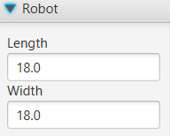

# FTCLib Trajectory Visualizer

## Features

* Custom constraints and robot sizing
* Play/Pause button for trajectory animation
* Save trajectories as .pog files for reuse and portability
* Java file generation for direct use in your Android Studio project

## Requirements

[VSCode](https://code.visualstudio.com/download)

## Installation

1) Install [VSCode](https://code.visualstudio.com/download)
2) Fork and clone this repository onto your local device
3) Open your new project inside VSCode
   - File > Open Folder...

## Usage

### Trajectory Options

#### Constraints

These values are meant to be replaced with your tuned constants in your Android Studio project to allow for visualization to more closely resemble your robot's movement.

#### Start Pose

This is where you set the start position of the robot.
- Start X
  - X position of robot relative to field
- Start Y
  - Y coordinate of robot relative to field
- Start Heading **(NOTE: Unit is Degrees)**
  - Direction the robot is facing

Coordinates can be found by hovering the mouse over the desired location, and then looking at the bottom right corner of the program

#### Interior Waypoints

These coordinates are the intermediary points which the trajectory will pass through.

Create a new waypoint on clicking on the "Add Waypoint" button.

Remove a waypoint by clicking on the trash can symbol next to the desired waypoint's name (in bold).

X and Y coordinates for a waypoint are calculated in the same way as the start pose.

#### End Pose

This is the location and position where the robot ends the trajectory. Options are functionally the same to the [start pose dropdown](#start-pose)  

#### Robot

This is where you can change the size of the robot icon in the visualizer to replicate your robot's sizing. Units are in inches.

### Run Trajectory

You can run a created trajectory along with see approximately how long the trajectory would take for a robot with the specified [constraints](#constraints) and [sizing](#robot). Simply press the play button to begin the animation, and press the same button again (this time it will have a pause icon) to pause the animation. At any point, the time taken can be seen to the right of the progress bar, which lets you gauge how close the path is to completion. 

### File Dropdown

The FTCLib Trajectory Visualizer has the ability to save paths in a custom .pog (poggers) file for easy portability and reusability of paths. The file dropdown allows you to create and open .pog files inside the path visualizer.

#### Save

The save button allows you to save a trajectory you are currently working on. It opens up a file explorer which lets you decide where you want your in-progress trajectory should be saved and what it should be named. The file will be saved with a custom .pog file extension.

#### Load

The load button allows you to open .pog files to continue working on saved trajectories. It opens up the file explorer to let you choose which .pog file you want to open and run.

#### Reload

The reload button allows for you to reset the current trajectory view. It will delete every waypoint along with resetting the start pose, end pose, constraints, and robot sizing values.

### Export Dropdown

FTCLib Trajectory Visualizes also allows for the saving of a completed trajectory as a Java file. This file contains the constraints, start pose, end pose, and waypoints which you used to create the trajectory. The Java button opens a file explorer which will ask where you want to save the file. This code can be directly placed inside your Android Studio project to be referenced in op-modes.